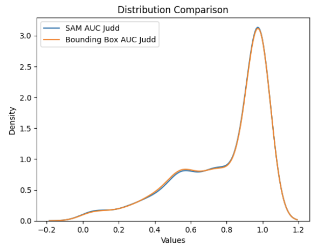
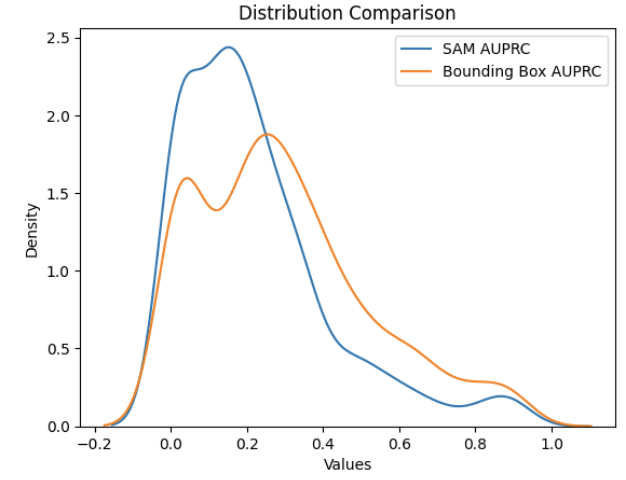
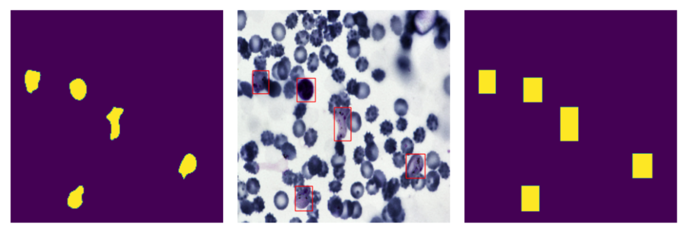
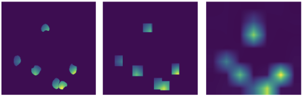
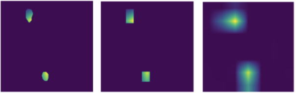

# Utilizing Segment Anything Model for Assessing Localization of GRAD-CAM in Medical Imaging
The introduction of saliency map algorithms as an approach for assessing the interoperability of images has allowed for a deeper understanding of current black-box models with Artificial Intelligence. Their rise in popularity has led to these algorithms being applied in multiple fields, including medical imaging. With a classification task as important as those in the medical domain, a need for rigorous testing of their capabilities arises. Current works examine capabilities through assessing the localization of saliency maps upon medical abnormalities within an image, through comparisons with human annotations. We propose utilizing Segment Anything Model (SAM) to both further the accuracy of such existing metrics, while also generalizing beyond the need for human annotations. Our results show both high degrees of similarity to existing metrics while also highlighting the capabilities of this methodology to beyond human-annotation. Furthermore, we explore the applications (and challenges) of SAM within the medical domain, including image pre-processing before segmenting, natural language proposals to SAM in the form of CLIP-SAM, and SAM accuracy across multiple medical imaging datasets.

## Results 
Analyzing our approach with the [Malaria Bounded Boxes dataset](https://www.kaggle.com/datasets/kmader/malaria-bounding-boxes), we found extremely similar results in comparison with AUC Judd, but against AUPRC, results showed our methodology to be more strict in how well GRAD-CAM localized. While we used a dataset with bounded boxes, in theory, this methodology can be used for any binary classification task, without any sort of segmentation pre-existing. We chose the dataset to serve as a ground truth for comparisons in metrics. Below are figures describing AUC Judd and AUPRC graphs from the bounded box vs SAM approach. 

  
   

## Examples 
The following are examples of SAM Masks in comparison with bounded boxes, as well as SAM masks with GRAD-CAM saliency maps. 

SAM Masks in comparison with bounded boxes: 

  

SAM Masks with GRAD-CAM saliency maps:

  
   

